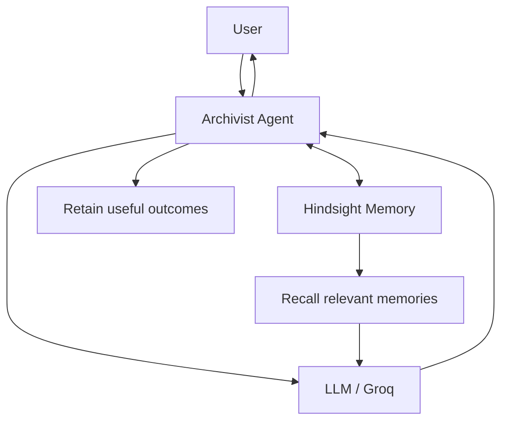
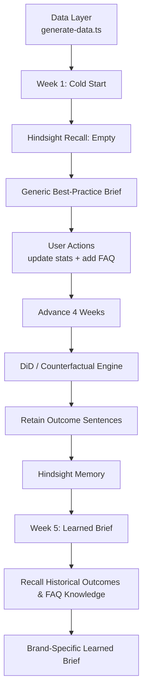

# Archivist

> A persistent-memory AI agent that learns from user interactions using Hindsight.

[](https://hw-h-3-0.vercel.app)

Archivist explores what changes when an AI agent can retain outcomes, recall historical context, and use learned information in future interactions instead of treating every interaction as a fresh start.

## Why Archivist?

Most AI agents are good at responding to the current context, but useful context can disappear between interactions.

Archivist adds a persistent memory layer so the agent can:

* retain meaningful outcomes from user interactions
* recall relevant historical context later
* distinguish a cold-start interaction from a learned interaction
* generate increasingly context-aware briefs
* expose the effect of memory through an evaluation workflow

The goal is not simply to store more conversation history. It is to make previously learned information affect future agent behavior.

## How It Works



### Memory Learning Flow

Archivist's evaluation flow models a cold-start agent, user actions, time advancement, outcome calculation, and later memory recall:



## Hindsight Integration

Hindsight is the persistent memory layer used by Archivist.

The core memory loop is:

```text
User interaction
      ↓
Identify useful outcome
      ↓
Hindsight Retain
      ↓
Persistent memory
      ↓
Hindsight Recall
      ↓
Relevant historical context
      ↓
LLM generates a more informed response
```

This allows Archivist to demonstrate a concrete transition from:

**Cold start → interaction → retained outcomes → future recall → learned behavior**

## Key Features

### Persistent Agent Memory

Retains useful information so it can influence future interactions.

### Memory Recall

Retrieves relevant historical information when generating later briefs.

### Cold-Start vs Learned Behavior

The application explicitly demonstrates how the agent behaves before and after memory has been accumulated.

### Outcome Evaluation

User actions can be evaluated against controls and counterfactuals to measure the resulting effect.

### Time-Based Simulation

The evaluation flow can advance the simulated timeline so the effect of retained information can be observed over multiple weeks.

### Dashboard

A dashboard exposes the Week 1 and Week 5 states, including the learned-memory view.

## Evaluation Flow

Archivist uses a deterministic data layer to make the evaluation reproducible.

```text
generate-data.ts
       │
       ├── posts.json
       ├── groundtruth.json
       └── metrics.json
```

The simulated workflow is:

1. Start with a cold agent in Week 1.
2. Generate a baseline brief with no recalled Hindsight memory.
3. Let the user select/update states and add information.
4. Advance the simulated timeline.
5. Calculate outcomes against controls/counterfactuals.
6. Retain useful outcome sentences in Hindsight.
7. Advance to Week 5.
8. Recall historical outcomes and generate a learned brief.
9. Compare the resulting behavior in the dashboard.

## API Flow

The application exposes the main evaluation operations through API routes:

| Route          | Purpose                                              |
| -------------- | ---------------------------------------------------- |
| `/api/brief`   | Generate the initial brief                           |
| `/api/action`  | Apply a user action/update                           |
| `/api/advance` | Advance the simulated timeline                       |
| `/api/brief`   | Generate a later learned brief using recalled memory |

The exact request/response schemas are defined in the application source.

## Tech Stack

| Layer        | Technology   |
| ------------ | ------------ |
| Framework    | Next.js 14   |
| Language     | TypeScript   |
| UI           | React 18     |
| Styling      | Tailwind CSS |
| LLM          | Groq SDK     |
| Agent Memory | Hindsight    |
| Validation   | Zod          |
| Charts       | Recharts     |
| Icons        | Lucide React |

## Getting Started

### Prerequisites

* Node.js
* npm
* Required API credentials for the services used by the application

### 1. Clone the repository

```bash
git clone https://github.com/Rajasekhar-dotcom/Archivist.git
cd Archivist
```

### 2. Install dependencies

```bash
npm install
```

### 3. Configure environment variables

Create a local environment file:

```bash
cp .env.example .env.local
```

Then add the required credentials.

> Never commit `.env.local` or API keys to the repository.

If `.env.example` is not present in the repository yet, create it from the environment variables currently required by the application before publishing setup instructions.

### 4. Generate evaluation data

```bash
npm run generate-data
```

### 5. Start the development server

```bash
npm run dev
```

Open:

```text
http://localhost:3000
```

## Available Scripts

```bash
npm run dev
```

Starts the Next.js development server.

```bash
npm run build
```

Creates a production build.

```bash
npm run start
```

Starts the production server.

```bash
npm run lint
```

Runs linting.

```bash
npm run generate-data
```

Generates the deterministic evaluation data.

```bash
npm run test:did
```

Runs the difference-in-differences evaluation test.

## Project Structure

```text
Archivist/
├── data/                         # Evaluation and generated data
├── scripts/
│   ├── generate-data.ts          # Deterministic dataset generation
│   └── test-did.ts               # DiD evaluation test
├── src/                          # Application source
├── public/                       # Static assets
├── package.json
├── package-lock.json
├── next.config.mjs
├── tailwind.config.ts
├── tsconfig.json
└── README.md
```

## Example: From Cold Start to Learned Memory

### Week 1 — Cold Start

The agent has no relevant Hindsight memory available.

```text
Hindsight Recall
      ↓
    Empty
      ↓
Generic best-practice brief
```

### User Actions

The user can update states and add information to the simulated environment.

```text
User selects update states
        +
User adds information
        ↓
Action API
        ↓
Time advances
```

### Outcome Retention

The evaluation engine calculates the effect of the actions and retains useful outcome statements.

```text
Outcome calculation
        ↓
Outcome sentences
        ↓
Hindsight Retain
```

### Week 5 — Learned State

The agent can now recall information accumulated through the simulation.

```text
Hindsight Recall
        ↓
Historical outcomes + learned context
        ↓
Brand-specific learned brief
```

This is the central behavior Archivist is designed to demonstrate: **memory changes what the agent can know and use later.**

## Reproducibility

The data layer uses deterministic generation so the evaluation workflow can be reproduced consistently.

The repository includes generated evaluation inputs such as:

* posts
* ground-truth outcomes
* metrics

This makes it possible to test the cold-start and learned-memory states using the same underlying scenario.

## Design Principles

### Memory should affect behavior

Memory is useful only when recalled information changes what the agent does next.

### Separate current context from learned context

The system distinguishes the initial interaction from information accumulated through later outcomes.

### Make evaluation observable

The dashboard and simulation flow make the effect of memory inspectable instead of treating memory as an invisible implementation detail.

### Prefer reproducible experiments

Deterministic data and explicit time advancement make the memory-learning workflow easier to reproduce and evaluate.

## Demo

**Live application:**
https://hw-h-3-0.vercel.app

A recommended demo flow is:

1. Open the Week 1 view.
2. Observe the initial generic brief.
3. Perform the available user actions.
4. Advance the simulated timeline.
5. Inspect the retained outcomes.
6. Open the Week 5 view.
7. Compare the learned brief with the original cold-start behavior.

## Documentation

Project planning and implementation documents are available in the repository.

For Hindsight:

* [Hindsight GitHub](https://github.com/vectorize-io/hindsight)
* [Hindsight Documentation](https://hindsight.vectorize.io/)

## Status

Archivist is an actively developed project. The repository contains the current application implementation, evaluation workflow, and supporting data-generation scripts.
